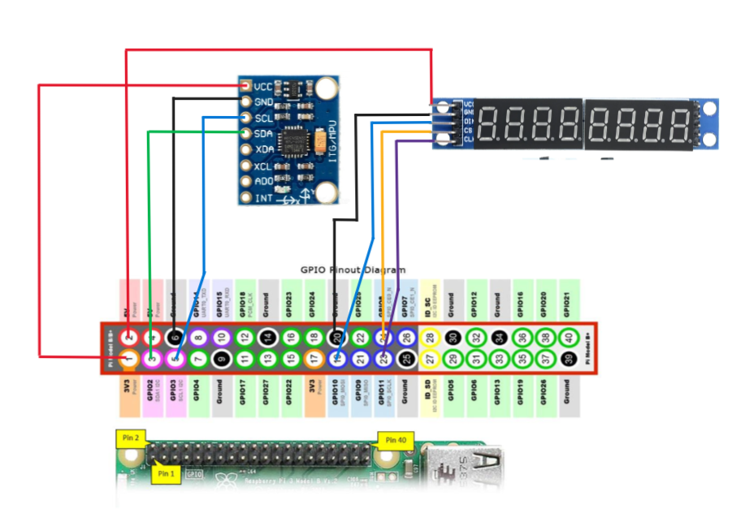

# Code MPU6050 and MAX7219
Embedded System at HCMUTE
## Wiring diagram raspberry with MPU6050 and max7219


## Hardware connection
 
|   RASPBERRYPI PIN    |   MPU6050 PIN   |   |   RASPBERRYPI PIN   |   MAX7219 PIN   |
| :-------------------:|:---------------:|:-:|:-------------------:|:---------------:|
|        1 (3.3V)      |       VCC       |   |         2 (5V)      |       VCC       |
|           6          |       GND       |   |          20         |       GND       |
|           3          |       SDA       |   |          19         |       DIN       |
|           5          |       SCL       |   |          24         |        CS       |
|                      |                 |   |          23         |       CLK       |  

## Compile and run the program
Download `libMPU6050.a` and `libMAX7219.a` in `lib` folder and `getAllData.c` in `example` folder to the same path

```
  cd path
  # Compile
  gcc getAlldata.c -o run -lm -li2c -L. libMPU6050.a -L. libMAX7219.a
  # Run
  ./run
```
